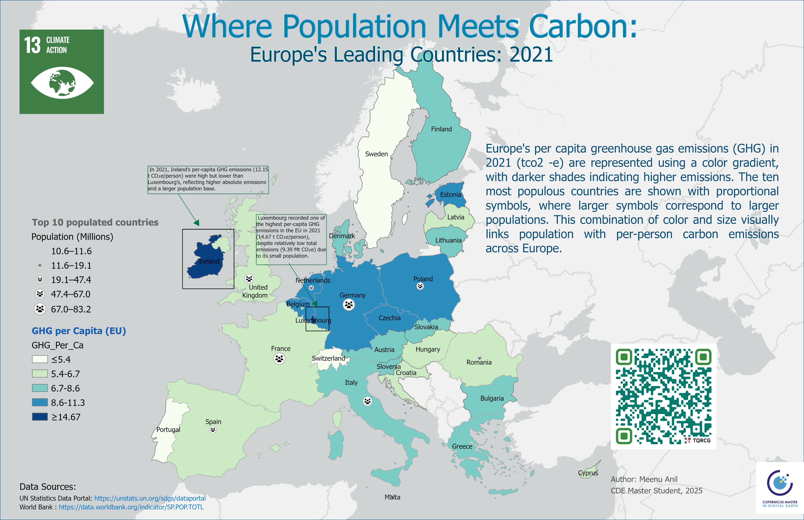

# 🌍 EU GHG per Capita
**This project is part of the Advanced Cartography course**

---

<!-- =============================== -->
<!-- HERO / HEADER -->
<!-- =============================== -->

<!-- Hero Section: Logo + Title -->

  
   Where Population Meets Carbon

Europe’s Leading Countries (2021)

Advanced Cartography · Climate Data Visualization · GIS Analysis

<!-- Banner Wallpaper -->

<!-- Webmap Link -->

  <a href="https://meenuanil.github.io/ghg-per-capita-eu/" style="text-decoration:none; padding:10px 20px; background-color:#1f4e79; color:white; border-radius:6px;">🌐 View Webmap</a>

---

## Project Overview

This project presents a **thematic choropleth map of greenhouse gas (GHG) emissions per capita across European countries**, combined with **proportional symbols representing the ten most populated European countries (2021)**.

Developed for the **Advanced Cartography** course, the project explores the **spatial relationship between population size and per-capita carbon emissions**, applying advanced cartographic principles for clarity and academic rigor.

---

## Objectives

- Visualize **GHG emissions per capita** across Europe  
- Highlight the **ten most populated European countries**  
- Apply **advanced cartographic principles** in thematic map design  
- Demonstrate **CRS selection, classification methods, and visual hierarchy**  
- Communicate climate-related spatial patterns academically  

---

## Data Sources

| Dataset | Source | Notes |
|---------|--------|-------|
| Greenhouse Gas Emissions (per capita) | United Nations Statistics Division | SDG Indicator 13.2.2 |
| Population Data (2021) | World Bank – SP.POP.TOTL | Top 10 countries filtered |
| Basemap & Boundaries | Esri, TomTom, Garmin, FAO, NOAA, USGS, OpenStreetMap contributors | Cleaned and harmonized |

---

## Methodology

### 1. Data Preparation
- Processed datasets using **Microsoft Excel**  
- Filtered top 10 most populated European countries  
- Linked statistical data to spatial boundaries  

### 2. Projection / CRS Selection
- Selected Europe-appropriate projected CRS  
- Balanced area preservation and visual clarity  

### 3. Thematic Mapping
- Choropleth mapping for GHG per capita  
- Sequential color scheme (darker = higher emissions)  
- Proportional symbols for population size  

---

## Cartographic Design Principles

- Data normalized using **per capita indicators**  
- Appropriate classification schemes for clarity  
- Clear visual contrast between choropleth colors and proportional symbols  
- Balanced layout: legend, scale bar, north arrow  
- Integration of **SDG 13 – Climate Action** thematic context  

---

## Languages & Libraries

| Language / Library | Purpose |
|-------------------|---------|
| HTML              | Structure and layout of the webmap page |
| CSS               | Styling and responsive design |
| JavaScript        | Interactivity and dynamic map features |
| Leaflet.js        | Creating the interactive choropleth webmap and adding proportional symbols |

---

## Tools & Software Used

| Software | Purpose |
|----------|---------|
| QGIS     | Spatial data processing & thematic mapping |
| ArcGIS Pro | Cartographic layout design & refinement |
| Microsoft Excel | Data cleaning and preparation |

---

## Map Output

---

## Access the Project

[🌐 View Webmap](https://meenuanil.github.io/ghg-per-capita-eu/)

---

## Authorship

**Map Author:** Meenu Anil  
Master’s in Geospatial Analytics  
Advanced Cartography

---

## License

This project is intended for **academic and educational purposes only**.  
All data sources retain their original licenses.
